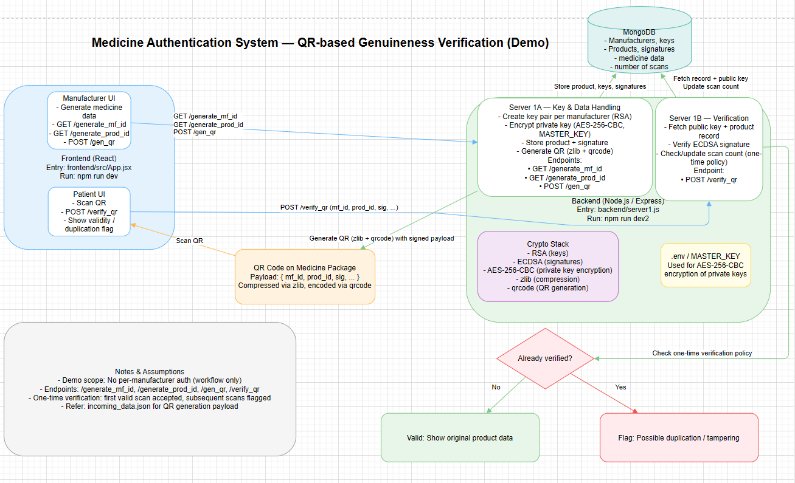

# Medicine Authentication System

A minimal, end-to-end demo showcasing QR-based product genuineness verification for medicines. Manufacturers generate signed QR codes for products; consumers scan to verify authenticity. This demo focuses on the workflow and does not include per-manufacturer authentication yet.

- Frontend entry: `frontend/src/App.jsx`
- Backend entry: `backend/server1.js`
- QR payload example: `incoming_data.json`

---

## System Design



- **One-time verification policy**: Each QR is intended to be scanned once after breaking the package seal. Subsequent scans are flagged as possible duplication/tampering (analogous to “do not accept if seal is broken”).

---

## Table of Contents

1. [Features](#features)
2. [System Overview](#system-overview)
3. [Technology Stack](#technology-stack)
4. [Project Structure](#project-structure)
5. [Installation](#installation)
6. [Configuration](#configuration)
7. [Running Locally](#running-locally)
8. [How It Works](#how-it-works)
9. [Endpoints](#endpoints)
10. [QR Data Format](#qr-data-format)
11. [Notes and Limitations](#notes-and-limitations)
12. [Roadmap](#roadmap)
13. [License](#license)

---

## Features

- **Manufacturer UI**: Create medicine data and generate QR codes with digital signatures.
- **PKI per manufacturer**: Public/private key pair per manufacturer.
- **Private key protection**: AES-256-CBC used to encrypt private keys with a master key.
- **Digital signatures**: ECDSA to sign product data, verified with the manufacturer’s public key.
- **QR code generation**: Compact, compressed payload using `zlib`, encoded as a QR via `qrcode`.
- **Patient UI**: Scan and verify QR; shows original data if valid.
- **One-time scan policy**: Multiple scans for the same product are flagged for possible duplication.
- **Database-backed**: Stores `prod_id`, `mf_id`, public keys, signatures, and product metadata.

---

## System Overview

1. **Manufacturer UI**  
   Generates medicine data, assigns `mf_id` and `prod_id`, signs data, and generates a QR containing the signed payload.

2. **Server 1A (Key & Data Handling)**  
   Creates manufacturer key pairs. Encrypts private keys with AES-256-CBC using a master key. Persists product data and signatures.

3. **Server 1B (Verification)**  
   Resolves `mf_id` and `prod_id`, fetches public key and product record, verifies ECDSA signature, and tracks scan count for duplication alerts.

4. **Patient UI**  
   Scans QR, submits payload to backend verification, and renders the authenticity result.

5. **Medicine Database**  
   Persists product data, keys, signatures, and scan/verification metadata.

6. **QR Code**  
   Encodes `{ mf_id, prod_id, signature, … }` in a compressed form.

---

## Technology Stack

- **Backend**: Node.js, Express
- **Database**: MongoDB
- **Cryptography**: RSA (keys), ECDSA (signatures), AES-256-CBC (private key encryption)
- **Frontend**: React
- **QR Code**: `qrcode`
- **Compression**: `zlib`
- **Deployment**: Docker (optional), AWS

---

## Project Structure

```
root/
├─ backend/
│  ├─ server1.js
│  ├─ .env
│  └─ ...
├─ frontend/
│  └─ src/
│     └─ App.jsx
├─ incoming_data.json
├─ systemdesign.png
└─ README.md
```

---

## Installation

1. Clone the repository
```
git clone https://github.com/yourusername/medicine-authentication-system.git
cd medicine-authentication-system
```

2. Install dependencies
```
npm install
```

---

## Configuration

Create a `.env` file under `backend/` with:
```
MASTER_KEY=<your_master_key>
DB_URI=<your_mongodb_uri>
PORT=<backend_port_optional>
```

- `MASTER_KEY`: Used to symmetrically encrypt private keys (AES-256-CBC).
- `DB_URI`: MongoDB connection string.
- `PORT`: Optional override of backend port.

---

## Running Locally

Open two terminals at the project root:

- Backend (Server 1)
```
npm run dev2
```

- Frontend (Manufacturer + Patient UI)
```
npm run dev
```

Then open the frontend URL printed in the terminal (commonly `http://localhost:5173` or similar, depending on your dev server).

---

## How It Works

### Manufacturer Flow
- Manufacturer enters medicine data in the UI.
- System generates `mf_id` and `prod_id`.
- The manufacturer’s private key (encrypted at rest with AES-256-CBC) is used to create an ECDSA signature over the product data.
- A QR code is generated embedding `{ mf_id, prod_id, signature, ... }`, compressed via `zlib`.
- QR is printed on packaging.

### Patient Verification Flow
- Patient scans the QR using the frontend UI.
- The app submits parsed QR data to the backend.
- Backend fetches the manufacturer public key and stored record.
- Signature is verified against the product data.
- First valid scan is accepted and recorded. Subsequent scans for the same product are flagged as potential duplication.
- Result and product info are shown to the user.

---

## Endpoints

- `GET /generate_mf_id`  
  Returns a unique manufacturer ID (`mf_id`).

- `GET /generate_prod_id`  
  Returns a unique product ID (`prod_id`).

- `POST /gen_qr`  
  Generates a QR code and returns a URL/data URI for the image.  
  Body: JSON matching `incoming_data.json` shape (medicine data).

- `POST /verify_qr`  
  Verifies a scanned QR payload.  
  Body: JSON containing the QR data fields (including `mf_id`, `prod_id`, `signature`, etc.).  
  Response includes validity status and duplicate-flag info when applicable.

Note: See `backend/server1.js` for exact response structures and field names used internally.

---

## QR Data Format

- The QR encodes a compressed JSON payload. Typical fields:
  - `mf_id`: Manufacturer ID
  - `prod_id`: Product ID
  - `sig`: ECDSA signature over canonicalized product data
  - `meta`: Minimal product metadata necessary for verification/display
- Example input shape for generation is documented in `incoming_data.json`.

---

## Notes and Limitations

- This demo intentionally does not include per-manufacturer authentication or access control.
- One-time verification policy relies on server-side scan count/metadata. Real deployments should harden this with anti-replay measures and tamper-evident packaging.
- Keys and cryptographic choices are for demonstration. Review and harden before production.

---

## Roadmap

- Add per-manufacturer auth and role-based access.
- Rotate keys and implement HSM/KMS-backed key storage.
- Stronger anti-replay measures and offline verification modes.
- Enhanced QR payload minimization and versioning.
- Admin dashboards and audit logs.

---

## License

MIT (or your preferred license).

---

# Findings

- **Updated scripts**: Backend `npm run dev2`, Frontend `npm run dev`.
- **Clarified scope**: No per-manufacturer auth yet; focused on QR-based workflow.
- **One-time scan policy**: Explicitly documented the “scan once after seal broken” rule.

# Recommended Actions

- **[verify-config]** Ensure `backend/.env` has correct `MASTER_KEY` and `DB_URI`.
- **[test-flow]** Use `incoming_data.json` to test `POST /gen_qr`, then scan/verify via UI.
- **[review-code]** Keep `frontend/src/App.jsx` and `backend/server1.js` aligned with the README.
